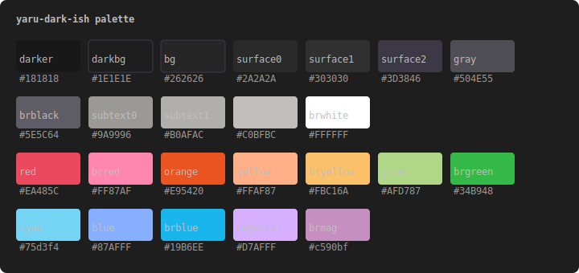

# yaru-dark-ish.nvim

A dark Neovim colorscheme inspired by Ubuntu's [Yaru](https://github.com/ubuntu/yaru) theme, with some personal tweaks.

## Palette



<!-- COLORS:START -->
| Name | Hex | Preview |
|------|-----|---------|
| `darker` | `#181818` |  |
| `darkbg` | `#1E1E1E` |  |
| `bg` | `#262626` |  |
| `surface0` | `#2A2A2A` |  |
| `surface1` | `#303030` |  |
| `surface2` | `#3D3846` |  |
| `gray` | `#504E55` |  |
| `black` | `#303030` |  |
| `brblack` | `#5E5C64` |  |
| `subtext0` | `#9A9996` |  |
| `subtext1` | `#B0AFAC` |  |
| `fg` | `#C0BFBC` |  |
| `white` | `#C0BFBC` |  |
| `brwhite` | `#FFFFFF` |  |
| `red` | `#EA485C` |  |
| `brred` | `#FF87AF` |  |
| `orange` | `#E95420` |  |
| `yellow` | `#FFAF87` |  |
| `bryellow` | `#FBC16A` |  |
| `green` | `#AFD787` |  |
| `brgreen` | `#34B948` |  |
| `cyan` | `#75d3f4` |  |
| `brcyan` | `#87AFFF` |  |
| `blue` | `#87AFFF` |  |
| `brblue` | `#19B6EE` |  |
| `magenta` | `#D7AFFF` |  |
| `brmag` | `#c590bf` |  |
<!-- COLORS:END -->

## Installation

Using [lazy.nvim](https://github.com/folke/lazy.nvim):

```lua
{
  "dapc11/yaru-dark-ish.nvim",
  lazy = false,
  priority = 1000,
  config = function()
    vim.cmd.colorscheme("yaru-dark-ish")
  end,
}
```

## Features

- Single-file colorscheme — no dependencies, no build step
- Treesitter, LSP, and diagnostic highlight groups
- Support for popular plugins (Telescope, Gitsigns, Cmp, Mini, Snacks, and more)
- Terminal colors included
